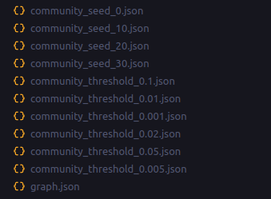
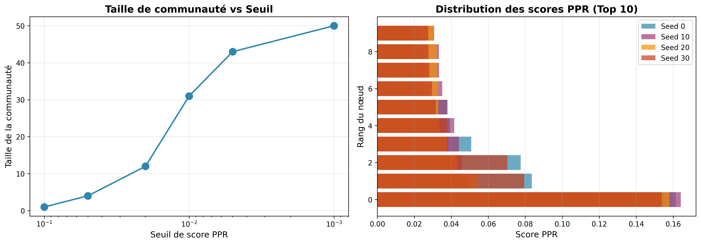
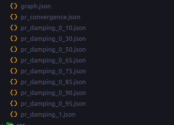
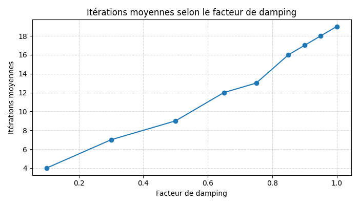
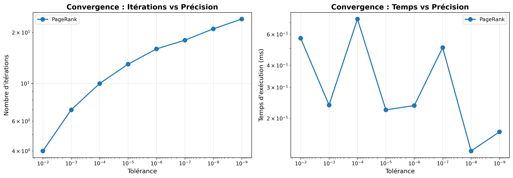
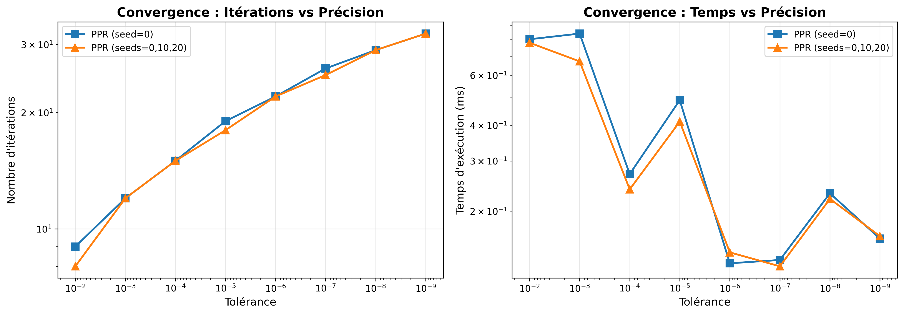
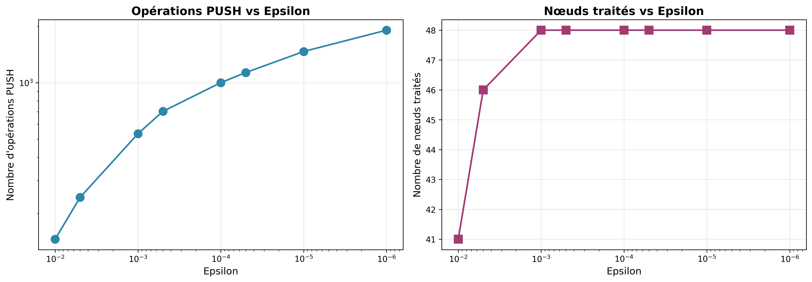
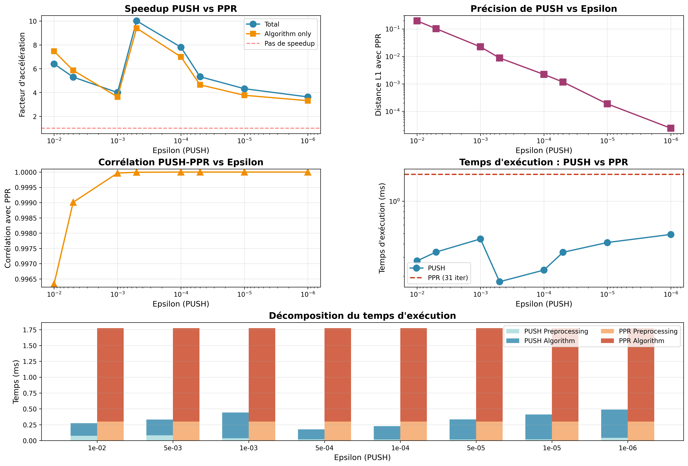
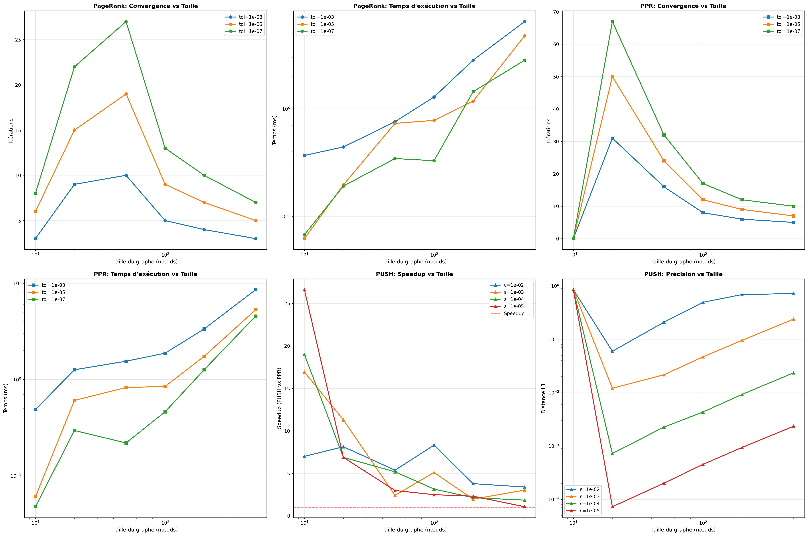

# AAGA — PageRank, PPR & PUSH

Reda Boudrouss, Deniz, Noé

Ce répertoire contient des scripts pour effectuer des études complètes des algorithmes PageRank, PPR et PUSH.

## Sommaire
- Présentation
- Prérequis
- Structure du dépôt
- Tests
- Utilisation rapide (CLI)
- Études et visualisations


## Presentation

Ce dépôt de code contient une implémentation des algorithmes PageRank, Personalized PageRank (PPR) et PUSH en TypeScript, ainsi qu’une série de tests unitaires dans le dossier `/test`. Nous incluons également des scripts de visualisation en Python et un script d’étude des algorithme en Bash.


## Prerequis

Si c'est le zip de rendu, il est seulement nécessaire d'avoir `Node.js` installé. Les fichiers bundlés et exécutables devraient se trouver dans le dossier `dist`.

Pour executer le CLI, il suffit de lancer la commande suivante:
```
./cli [options] [command]
```

Sinon (ou si vous voulez compiler vous-même le CLI), il est nécessaire d'avoir deno installé.


* Installation des librairie
```
deno i
```
* Execution du main
```
deno run dev
```
* tests unitaires
```
deno run test
```
* Execution du CLI
```
deno run cli [options] [command]
```
* Execution de l'etude
```
bash ./study.sh
```
## Structure du dépot

```sh
├── src #implementation de PR, PPR et PUSH
│   ├── pagerank.ts
│   ├── PPR.ts
│   ├── PUSH.ts
│   ├── compat.ts #Fonctions de compatibilité entre Deno et Node.js
│   ├── graphGenerators.ts #Fonctions de génération de graphe
│   └── utils.ts #Typage et fonctions utiles (Graphe, Tableau d'adjacence, personalization vector)
├── tests #Test unitaire
│   ├── pagerank_test.ts
│   ├── PPR_test.ts
│   └── PUSH_test.ts
├── visualize.py #script d'analyse de convergence, Communautés et de performance
├── cli.ts #Code du CLI, s'occupe d'analyser les arguments et d'appeler les fonctions appropriées
├── main.ts #Script de test/dev, est executé par deno run dev
├── study.sh #Script d'etude (génére les résultat)
└── cli #Executable CLI (script qui detecte le runtime et execute le CLI)
```

## Encodage du graphe dans le code

Definition algorithmne grace au typage (avec fonction de conversition en liste d'adjacence):
```
export interface Graph {
  nodes: number[];
  edges: [number, number][];
}
```

## Cas d'utilisation du Cli ```cli.ts```

Pour avoir les informations pour chaque commande, il suffit de lancer la commande suivante:
```
./cli [command] --help
```

---
### `generate`

Génère un graphe orienté aléatoire selon de multiples algorithmne (erdos-renyi par defaut) selon une taille et une probabilité de creation d’arêtes entre chaque node.


#### utilisation

```
./cli generate
  -nodes, --size <number>
  -t, --type <algorithm>" # Generation algorithm: erdos-renyi (default), scale-free, small-world, multi-community, dag, bipartite, complete, cycle, grid, tree, barbell, star, path,erdos-renyi
  -p, --probability <number>
  -o, --output <file>
```


Retourne un fichier json ou une sortie au format:
```
{
  "nodes": [0, 1, 2, ..., N-1],
  "edges": [
    [0, 1],
    [1, 2],
    [2, 0]
  ]
}
```

#### exemple
Generation d'un graphe N=100 avec une probabilité d'arrète de 0.5.

*input:*
```./cli generate --nodes 10 --probability 0.5 --output graph.json```

*output:*
```
Graph written to graph.json
Nodes: 10, Edges: 44
```

*graph.json*
```

{"nodes":[0,1,2,3,4,5,6,7,8,9],"edges":[[0,1],[0,2],[0,3],[0,5],[1,2],[1,4],[1,6],[2,1],[2,3],[2,4],[2,7],[3,0],[3,2],[3,7],[3,9],[4,0],[4,2],[4,5],[4,6],[5,2],[5,7],[6,0],[6,4],[6,5],[6,8],[7,1],[7,3],[7,4],[7,6],[7,8],[7,9],[8,0],[8,1],[8,2],[8,7],[9,1],[9,2],[9,3],[9,4],[9,5],[9,7],[9,8]]}

```

---

### `run`

Exécute un algorithme de type **PageRank**, **PPR** (Personalized PageRank) ou **PUSH** sur un graphe fourni.

#### utilisation

```
./cli run
  -a, --algorithm <type>
  -f, --file <input graph path>
  -i, --input <edges>
  -s, --seeds <nodes>
  -d, --damping <number>
  -e, --epsilon <number>
  -p, --performance
```
Retourne le score après convergence

#### exemple

Exécution de PPR sur un graphe orienté défini par

sommets : V = {0, 1, 2}
arêtes : E = {0→1, 1→2, 2→0}
avec comme noeuds sources (seed) positionné sur les sommets 0 et 1.


*input*
```
./cli run --algorithm ppr --input "0-1,1-2,2-0" --seeds 0,1
```

*output*

```

PPR converged after 86 iterations
[
  0.3347911788117261,
  0.3595721402333021,
  0.3056366809549719
]
```
---

### `convergence`

Étudie la **convergence** de PageRank ou PPR en faisant varier la tolérance.

#### utilisation

```
./cli convergence
  -a, --algorithm <type>
  -f, --file <path>
  -i, --input <edges>
  -s, --seeds <nodes>
  -d, --damping <number>
  -t, --tolerances <values>
  -o, --output <file>
```

#### exemple

Cette commande exécute successivement PageRank sur le graphe contenu dans graph.json pour les tolérances 10⁻³, 10⁻⁴ et 10⁻⁵, renvoyant :
* le nombre d'iteration
* si le graphe à convergé
* difference residuelle
* le temps d'execution pour chaque convergence (Ms)

*input*
```
./cli convergence --algorithm pagerank --file graph.json --tolerances "1e-3,1e-4,1e-5"
```
*output*
```

[
  {
    "tolerance": 0.001,
    "iterations": 8,
    "converged": true,
    "finalDiff": 0.000697370428223397,
    "executionTimeMs": 0.2182580000000005
  },
  {
    "tolerance": 0.0001,
    "iterations": 11,
    "converged": true,
    "finalDiff": 0.00008076963210938704,
    "executionTimeMs": 0.10759099999999933
  },
  {
    "tolerance": 0.00001,
    "iterations": 14,
    "converged": true,
    "finalDiff": 0.000009528701552130592,
    "executionTimeMs": 0.10049799999999998
  }
]
```
---

### `community`

community exécute un Personalized PageRank local (PPR) à partir d’un ensemble de nœuds sources (seeds) afin d’identifier une communauté locale dans le graphe.

### utilisation

```
./cli community
  -f, --file <path>
  -i, --input <edges>
  -s, --seeds <nodes>
  -d, --damping <number>
  -e, --epsilon <number>
  -t, --threshold <number>
  -o, --output <file>
```

#### exemple


détection de communauté locale à l’aide de PPR sur un graphe orienté défini par les arêtes 0→1, 1→2 et 2→0.
On execute PPR sur le graphe.
Une fois la convergence atteinte, les noeud avec un score qui depasse le seuil constituent la communauté finale.

*input*
```
./cli community --input "0-1,1-2,2-0" --seeds 0,2 --damping 0.9 --epsilon 1e-5 --threshold 0.01
```
*output*
```
{
  "seeds": [
    0,
    2
  ],
  "damping": 0.9,
  "tolerance": 0.00001,
  "threshold": 0.01,
  "iterations": 110,
  "converged": true,
  "executionTimeMs": 0.4388400000000008,
  "communitySize": 3,
  "community": [
    {
      "node": 0,
      "score": 0.3505505835845029
    },
    {
      "node": 2,
      "score": 0.3339497235652355
    },
    {
      "node": 1,
      "score": 0.3154996928502617
    }
  ]
}
```
---

### `compare`

Compare les algorithmes **PPR** et **PUSH** sur un même graphe afin de mesurer leurs performances, similarités et vitesses relatives.

### utilisation

```
./cli compare
  -f, --file <path>
  -i, --input <edges>
  -s, --seeds <nodes>
  -d, --damping <number>
  -e, --epsilons <values>
  -t, --tolerance <number>
  --community-threshold <number>
  -o, --output <file>
```
### example

Comparaison de PPR et PUSH avec epsilon=$1*10^-3$ sur le graphe  {0→1, 1→2, 2→0}

*input*
```./cli compare --input "0-1,1-2,2-0" --seeds 0 --damping 0.85 --epsilons "1e-3"   ```
*output*
```

{
  "seeds": [
    0
  ],
  "damping": 0.85,
  "ppr": {
    "tolerance": 0.000001,
    "iterations": 90,
    "converged": true,
    "executionTimeMs": 0.3811119999999999,
    "preprocessingTimeMs": 0.17112000000000016,
    "algorithmTimeMs": 0.20404200000000117,
    "communitySize": 3
  },
  "push": [
    {
      "epsilon": 0.001,
      "pushOperations": 43,
      "nodesProcessed": 3,
      "executionTimeMs": 0.09261400000000108,
      "preprocessingTimeMs": 0.01237300000000019,
      "algorithmTimeMs": 0.0706420000000012,
      "communitySize": 3,
      "comparison": {
        "l1Distance": 0.0009226007550896531,
        "l2Distance": 0.0005372647513646276,
        "maxDifference": 0.0003584929355138766,
        "correlation": 0.9999996828364274
      }
    }
  ],
  "speedup": [
    {
      "epsilon": 0.001,
      "speedupFactorTotal": 4.115058198544447,
      "speedupFactorAlgorithmOnly": 2.88839500580388
    }
  ]
}
```
En plus du temps d’exécution, de la convergence et de la taille de la communauté, on utilise la distance L1 $L_1 = \sum_{i=1}^{N} |x_i - y_i|$ et la distance euclidienne $ L_2 = \sqrt{\sum_{i=1}^{N} (x_i - y_i)^2}$ (utilisé egalement pour calculer l'erreur d'une prediction de trajectoire par ailleurs)

ainsi que la différence maximale et la corrélation pour comparer les résultats.

## Scripts d'etude ```study.sh```


Ce script Bash automatise une serie d'experience pour évaluer, comparer et analyser les performances des algorithmes **PageRank**, **Personalized PageRank (PPR)** et **PUSH** à travers plusieurs scénarios.

Il utilise les commandes du CLI `graph-cli` et génère des fichiers de résultats au format json pour une analyse ultérieure.

### utilisation

```
./study.sh [output_dir] [flags]

# Argument principal :
  output_dir               default : ./results
# Flags disponibles :
  --pr-conv                  # Étude de convergence du PageRank pour différentes tolérances et valeurs de damping
  --ppr-conv                 # Étude de convergence du Personalized PageRank (PPR) pour différentes seeds
  --community                # Détection de communautés locales autour de seeds avec variation du seuil d’appartenance
  --compare                  # Comparaison entre les algorithmes PUSH et PPR (temps, convergence, similarité)
  --scalability              # Étude de scalabilité : impact de la taille du graphe sur les performances
  --all                      # Exécute toutes les analyses ci-dessus (activé par défaut si aucun flag n’est passé)
  -v                         # Creer les visualisation des resultats a la fin du traitement
```


### Exemples :

Si l'on veux etudier les algorithmnes sur leur communauté:
**communauté**
```
./study.sh  --community
```
Cette commande génère un graphe aléatoire et effectue l'analyse de communauté (vue dans la section CLI) pour une série de seeds et de seuils, un peu à la manière d'une grid search.

On obtient une série de fichiers JSON enregistrant les résultats pour chaque seed et seuil, ainsi que le fichier du graphe.



On peut ensuite visualiser les résultats bruts avec visualise.py




**convergence (PageRank)**

```
./study.sh --pr-conv
```


On obtiens




---

**convergence (PPR)**

```
./study.sh --ppr-conv
```

On obtiens


---

**comparaison (PUSH vs PPR)**

```
./study.sh --compare
```






---

**scalabilité**

```
./study.sh --scalability
```

Cette commande évalue la scalabilité des algorithmes PageRank, PPR et PUSH en fonction de la taille du graphe. Elle genere 6 plot:

| Plot | Titre                                 | Objectif principal                                 |
| --------- | ------------------------------------- | -------------------------------------------------- |
| 1         | PageRank: Convergence vs Taille       | Itérations de convergence du PageRank              |
| 2         | PageRank: Temps d’exécution vs Taille | Temps de calcul du PageRank                        |
| 3         | PPR: Convergence vs Taille            | Itérations de convergence du Personalized PageRank |
| 4         | PPR: Temps d’exécution vs Taille      | Temps de calcul du Personalized PageRank           |
| 5         | PUSH: Speedup vs Taille               | Gain de performance du PUSH par rapport au PPR (a quel moment PPR devient plus efficace que PUSH ?)    |
| 6         | PUSH: Précision vs Taille             | Fidélité du PUSH comparée au PPR                   |

---

**toutes les analyses**

```
./study.sh --all
```

Ce mode exécute l’ensemble des études précédentes (convergence, PPR, communauté, comparaison et scalabilité) et enregistre tous les résultats dans le répertoire de sortie spécifié (`./results` par défaut).
