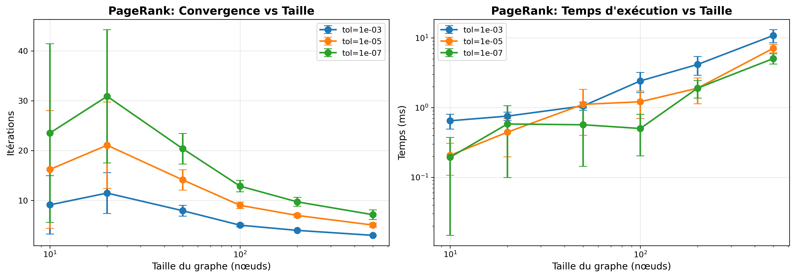
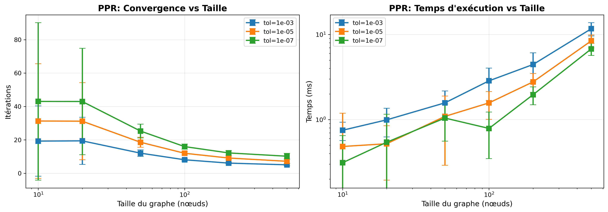
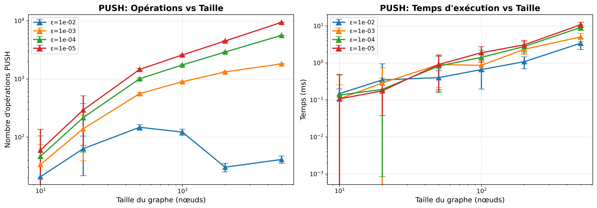
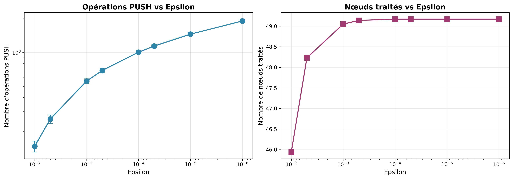
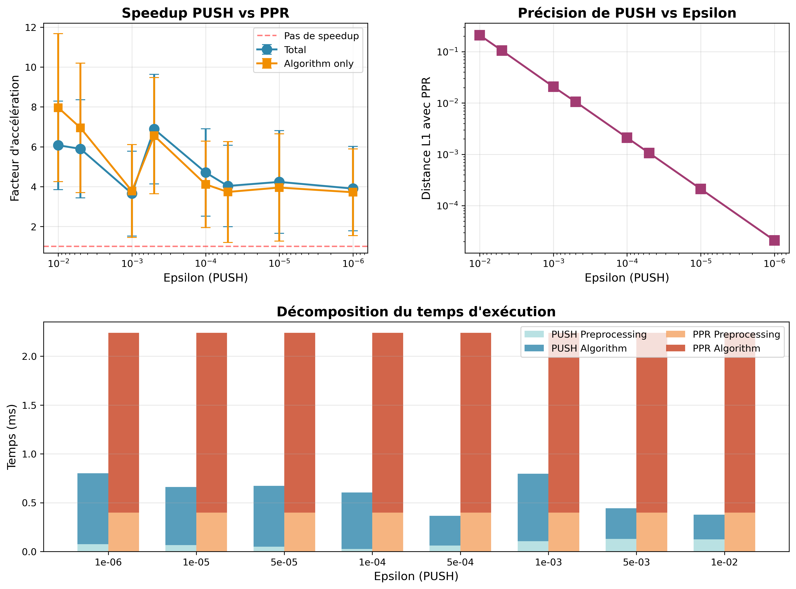
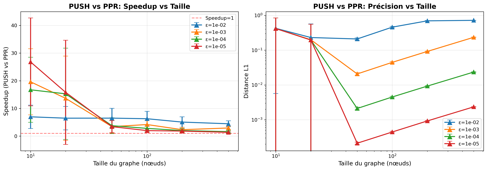
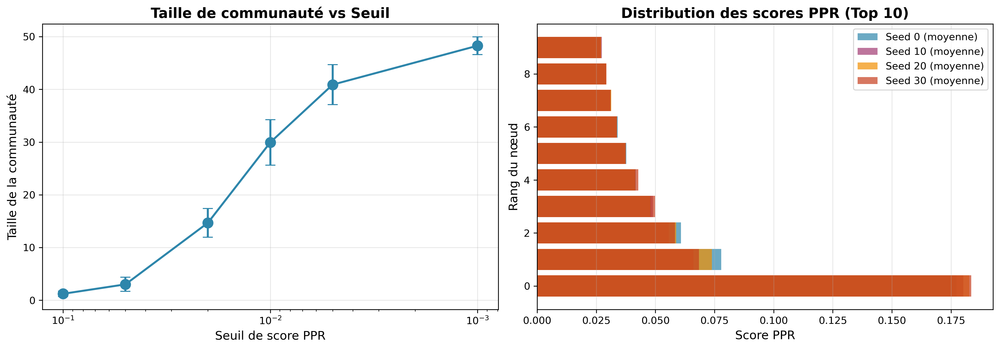

# 3. Résultats et analyse

Nous rappelons les objectifs fixés dans l'introduction : étudier la convergence du PageRank et du PPR en fonction de la précision, détecter les communautés locales via PPR, et comparer la méthode PUSH au PPR en termes de précision et de temps de calcul.

## 3.1. Méthodologie expérimentale

Les expérimentations ont été automatisées via le script `study.sh` qui orchestre l'ensemble des analyses. Ce script génère d'abord un graphe aléatoire d'Erdős–Rényi de 50 nœuds avec une probabilité de connexion de 0.08 (commande `./cli generate --nodes 50 -p 0.08`), puis exécute systématiquement :

1. L'étude de convergence du PageRank pour 8 niveaux de tolérance ($10^{-2}$ à $10^{-9}$)
2. L'étude de convergence du PPR avec un seed unique (nœud 0) et multiples seeds (nœuds 0, 10, 20)
3. La détection de communautés avec 6 seuils différents (0.001 à 0.1) et 4 seeds différents
4. La comparaison PUSH vs PPR pour 8 valeurs d'$\epsilon$ ($10^{-2}$ à $10^{-6}$)
5. L'étude de scalabilité sur 6 tailles de graphes (10 à 500 nœuds)

Tous les résultats sont sauvegardés au format JSON dans le répertoire `results/`. Le script `visualize.py` génère ensuite automatiquement les graphiques d'analyse en utilisant Matplotlib (si plusieurs exécutions ont été effectuées, les moyennes sont calculées). Cette approche garantit la reproductibilité complète des expérimentations : l'exécution de `./study.sh` suivie de `python visualize.py results/` régénère l'intégralité des données et visualisations.

Par défaut, le script `study.sh` exécute l'ensemble des analyses 10 fois pour chaque expérience, mais pour le rapport, nous avons exécuté l'analyse de scalabilité 100 fois afin d'améliorer la fiabilité des résultats.

## 3.2. Performance des algorithmes

### 3.2.1. PageRank

{#fig:scalability-pr}

La figure \ref{fig:scalability-pr} présente deux graphiques : le nombre d'itérations (gauche) en échelle semi-log et le temps d'exécution (droite) en échelle log-log en fonction de la taille du graphe.

En ce qui concerne le nombre d’itérations (graphique de gauche), on observe une forte disparité pour les petits graphes. Cependant, à mesure que la taille du graphe augmente, le nombre d’itérations tend à se stabiliser. Ce comportement s’explique principalement par le mode de génération aléatoire des graphes : sur de petits graphes, il est plus probable d’obtenir des structures particulières qui rendent la convergence plus ou moins rapide. En revanche, pour des graphes de taille moyenne à grande, ces effets aléatoires s’atténuent et le nombre d’itérations devient plus régulier.  
En moyenne, hormis les deux premiers points, on constate une légère diminution du nombre d’itérations avec la taille du graphe. Cela peut s’expliquer par le fait que, dans un graphe plus grand, le score associé à chaque nœud est plus faible, ce qui fait que la différence entre deux itérations successives devient plus rapidement inférieure au seuil de tolérance fixé.

Concernant le temps d’exécution (graphique de droite), celui-ci présente une croissance quasi linéaire en échelle log-log, mais avec une pente inférieure à 1 (comprise entre 0,5 et 0,75). Cette pente plus faible traduit une croissance sous-linéaire du temps d’exécution, cohérente avec la diminution du nombre d’itérations observée précédemment : plus le graphe est grand, moins il faut d’itérations pour atteindre la convergence, ce qui réduit le coût global.

### 3.2.2. Personalized PageRank

{#fig:scalability-ppr}

Tout comme pour PageRank, la figure \ref{fig:scalability-ppr} présente deux graphiques pour l'itération et le temps d'exécution en fonction de la taille du graphe.

En termes de nombre d'itérations (graphique de gauche), tout comme pour PageRank, on observe une forte disparité pour les petits graphes. Cependant, les moyennes sont relativement stables avec une légère diminution. Cela se traduit par une pente très proche de 1 pour le temps d'exécution (graphique de droite), ce qui confirme que le temps d'exécution de PPR est $O(k \cdot (N + M))$ comme attendu.

{#fig:convergence-pr-ppr}

La figure \ref{fig:convergence-pr-ppr} compare les algorithmes PageRank et PPR en termes de convergence sur le graphe de 50 nœuds en fonction de la tolérance (échelle log-log).

Pour le nombre d'itérations, nous remarquons que les courbes des 3 algorithmes ont la même forme (augmentent légèrement), mais que PPR nécessite légèrement plus d'itérations pour converger. En effet, les seeds commencent et reçoivent des probabilités plus élevées (notamment la téléportation), ce qui crée des gradients de probabilité plus prononcés qui nécessitent plus d'itérations pour se stabiliser uniformément sur tout le graphe.

Pour ce qui est du temps d'exécution, nous remarquons qu'il a tendance à diminuer avec la tolérance, ce qui est contre-intuitif. Les exécutions à elles seules semblent toujours montrer une croissance du temps d'exécution, mais nous ne savons pas pourquoi les moyennes ont cette tendance. Peut-être des optimisations du runtime JavaScript ?

### 3.2.3. PUSH

{#fig:scalability-push}

La figure \ref{fig:scalability-push} compare les performances de PUSH en fonction de la taille du graphe.

Nous remarquons dans le graphique de droite que le temps d'exécution de PUSH subit une croissance sous-linéaire, ce qui est assez étonnant puisque la complexité théorique de PUSH est $O(1/\epsilon)$. Cette tendance peut être expliquée par le fait que plus le graphe est grand, plus il y a de nœuds à traiter, et donc l'exécution de PUSH devient moins locale. La complexité théorique reste valable en ordre de grandeur, mais les coûts constants cachés dans la notation $O$ deviennent plus importants.
Cela est confirmé par le graphique de gauche qui montre le nombre d'opérations de PUSH. On observe une croissance sous-linéaire du nombre d'opérations avec la taille du graphe due à un plus grand nombre de nœuds à traiter.

{#fig:push-operations}

La figure \ref{fig:push-operations} montre la relation entre $\epsilon$ et le nombre d'opérations/nœuds traités sur le graphe de 50 nœuds.

Dans le graphique de gauche, nous pouvons observer que le nombre d'opérations de PUSH croît avec la diminution de $\epsilon$. Sauf qu'en théorie, nous sommes censés avoir une droite linéaire, mais nous observons une courbe légèrement concave. La courbe croît plus lentement que la théorie $O(1/\epsilon)$. Cela pourrait probablement être expliqué par la saturation de la propagation locale. En effet, quand $\epsilon$ est très petit, le résidu se propage à presque tout le graphe.
Cela est confirmé par le graphique de droite qui montre le nombre de nœuds traités. On observe une croissance qui atteint assez vite un plateau de 50 nœuds traités.

### 3.2.4. Comparaison PUSH vs PPR

{#fig:push-vs-ppr}

La figure \ref{fig:push-vs-ppr} présente 3 graphiques comparant PUSH et PPR sur le graphe de 50 nœuds.

D'après le graphique de gauche, nous pouvons affirmer dans un premier temps que PUSH est plus rapide que PPR pour tous les $\epsilon$ testés. À noter que pendant nos tests, il est arrivé dans certains cas, notamment pour des graphes de grande taille avec un $\epsilon$ petit, que PUSH soit plus lent que PPR.

À partir du graphique de droite, nous pouvons observer que la distance L1 entre PUSH et PPR diminue avec la diminution de $\epsilon$ de façon linéaire. Ce comportement est conforme à la théorie : le seuil $\epsilon$ borne directement le résidu maximal autorisé à chaque nœud, entraînant une erreur globale proportionnelle à $\epsilon$.

{#fig:scalability-push-vs-ppr}

La figure \ref{fig:scalability-push-vs-ppr} montre l'évolution du speedup et de la précision en fonction de la taille du graphe.

Dans le graphique de gauche (hormis les deux premiers points qui sont assez sensibles à la structure du graphe), nous remarquons une linéarité du speedup sur un graphique log-log avec la taille du graphe. Cela signifie que le speedup est proportionnel à la croissance de PPR et donc à la taille du graphe, ce qui est contre-intuitif. Peut-être que les choix de $\epsilon$ sont trop grands pour de petits graphes (de taille 50) ?

## 3.3. Détection de communautés

{#fig:community-analysis}

La figure \ref{fig:community-analysis} présente deux graphiques analysant la détection de communautés via PPR sur le graphe de 50 nœuds : la taille des communautés en fonction du seuil (gauche) et la distribution des scores au sein d'une communauté (droite).

Le graphique de gauche montre une augmentation de la taille de la communauté détectée à mesure que le seuil diminue. Ce comportement est attendu : un seuil plus faible permet d'inclure davantage de nœuds ayant des scores PPR plus faibles, élargissant ainsi la communauté autour du seed.

Le graphique de droite illustre la distribution des scores PPR au sein d'une communauté détectée, en fonction du rang des nœuds (triés par score décroissant). On observe une décroissance exponentielle très marquée : les premiers nœuds (rang faible) possèdent des scores significativement plus élevés que les suivants. Cette distribution confirme que PPR identifie efficacement un noyau central de nœuds fortement connectés au seed (scores élevés), entouré de nœuds périphériques (scores faibles). La forme exponentielle de cette courbe est caractéristique de la structure des communautés locales : quelques nœuds centraux dominent la probabilité de visite, tandis que la majorité des nœuds de la communauté ont des scores beaucoup plus faibles.
